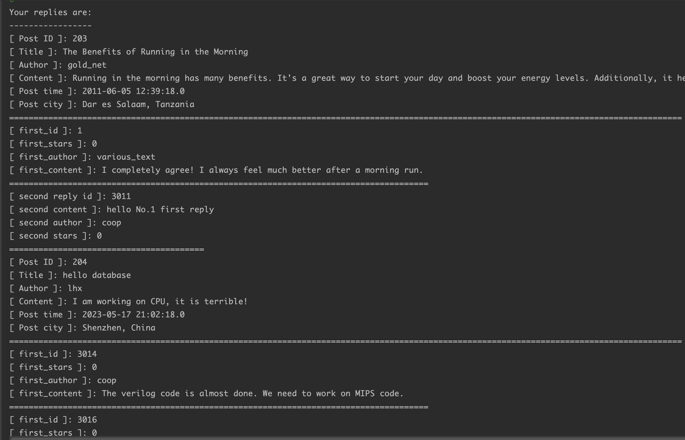
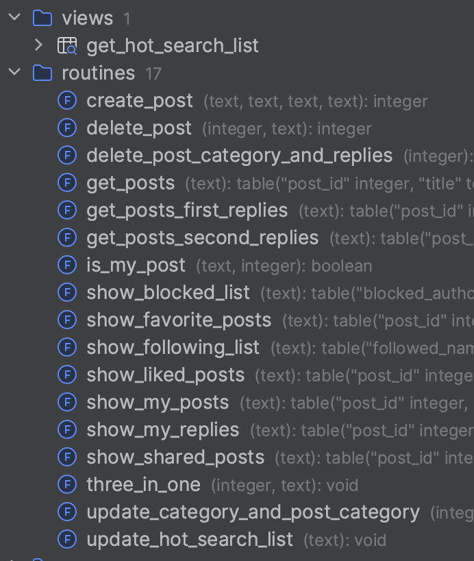

# CS307-Database Project 2

`Group Session`: Thursday 3-4

`Group Number`: 306

`Name(SID)`: 钟志源(12110517)、刘浩贤(12111515)

`Contribution`: 钟志源（java backend implementation, report writing）刘浩贤（database function design and implementation）

`Percentages of contributions`： 50% : 50%

## API Specification

### 1. Manipulation

#### 1.1 Account Handler

A class that handles all the account related operations(login, register, logout).

- `static String getUser()`: Return the current user's username.
- `void logout()` : Logout the current user.
- `void login()` : Ask for the username, and login the user.
- `void register()` : Ask for the username, phone number, ID, and register the user.
- `boolean nameIsIn(String name)` : Check if the `name` is in the `Authors` table. Return true if it is in the table, false otherwise.

#### 1.2 Action Handler

A class that handles all the actions related operations, including like, favorite, share, follow/unfollow, block/unblock, three in one(like, favorite, share at the same time).

- `void likePost()`: Ask for a post ID, and like the post.
- `void favoritePost()`: Ask for a post ID, and favorite the post.
- `void sharePost()`: Ask for a post ID, and share the post.
- `void threeInOne()`: Ask for a post ID, and like, favorite, share the post at the same time(一键三连).
- `boolean postIsIn(int pid)`: Check if the `pid` is in the `Posts` table. Return true if it is, false otherwise.
- `void followUser()`: Ask for a username, and follow the user.
- `void unfollowUser()`: Ask for a username, and unfollow the user.
- `void blockUser()`: Ask for a username, and block the user.
- `void unblockUser()`: Ask for a username, and unblock the user.

#### 1.3 Post Handler

A class that handles creating and deleting posts.

- `public void deletePost()`: Ask for a post ID, and check if the current user is the author of the post. If yes, delete the post.
- `public void createPost()`: Ask for a post title, content, and tags, and create a post under the current user.

#### 1.4 Reply Handler

A class that handles replying a post and replying a reply.

- `public void replyPost(boolean isAnonymous)`: Ask for a post ID, and reply the post anonymously or not according to the `isAnonymous` parameter.
- `public void replyReply(boolean isAnonymous)`: Ask for a first_reply ID, and reply the reply anonymously or not according to the `isAnonymous` parameter.

#### 1.5 Me Handler

A class that handles all the information of the current user.

- `void showLikedPosts()`: Show all the posts that the current user liked.
- `void showFavoritePosts()`: Show all the posts that the current user favorites.
- `void showSharedPosts()`: Show all the posts that the current user shared.
- `void showFollowingList()`: Show all the users that the current user is following.
- `void showBlockUsers()`: Show all the users that the current user has blocked.
- `void showMyPosts()`: Show all the posts that the current user has posted.
- `void showMyReplies()`: Show all the replies that the current user has posted.

#### 1.6 Browse Handler

A class that handles all the browsing operations, including browse (posts, with replies), hot search list display and update, Multi-search.

- `void browsePost(int opcode)`: Browse posts according to the `opcode`. For `opcode`, 1 means browse posts only, 2 means browse posts with first replies, 3 means browse posts with all replies. Ask for browsing parameters, including the parameters `codes` and the corresponding `values`. Then call `multiSearch` to do the search.
- `void multiSearch(String[] codes, String[] values, int opcode)`: Multi-value search according to the `codes`, `values` and `opcode`.
  - For `opcode`, 1 means search posts only, 2 means search posts with first replies, 3 means search posts with all replies.
  - For `codes`, 1 means search by `author name`, 2 means search by `keyword`, 3 means search by `categories`, 4 means search by `from_time`, 5 means search by `to_time`, 6 means search by `reply name`, 7 means search by `post id`.
  - For `values`, the value of `codes[i]` is `values[i]`.
- `void update_hot_search_list(String searchContent)`: Update the hot search list according to the `searchContent`.
- `void showHotSearchList()`: Show the hot search list.

#### 1.7 Printer

A class that handles all the printing operations, to print the results in cli.

- `void printPost(ResultSet rs)`: Accept a `ResultSet` **rs** and print the posts in `rs`.
- `void printFirstReply(ResultSet rs)`: Accept a `ResultSet` **rs** and print the posts with first replies in `rs`.
- `void printSecondReply(ResultSet rs, boolean isShowMe)`: Accept a `ResultSet` **rs** and print the posts with second replies in `rs`. If `isShowMe` is true, then only print the posts with second replies that the current user has replied.


### 2. Controller

A class that handles all the operations.

- Instance and static variables:
  - `Connection con`: The connection to the database.
  - `Scanner in`: The scanner to read the input from the cli.
  - `int opcode`: The current operation code.
  - `DBUtil util`: The database connection utility.
  - Below are the handlers instances:
  - `ActionHandler actionHandler`
  - `AccountHandler accountHandler`
  - `BrowseHandler browseHandler`
  - `ReplyHandler replyHandler`
  - `MeHandler meHandler`
  - `PostHandler postHandler`
- `void getConnection()`: Get the connection `con` to the database.
- `void closeConnection()`: Close all resources in all handlers and close the connection `con`.
- `void welcome()`: Print the welcome message.
- `void prompt()`: Show operation menu and prompt the user to choose an operation.
- `void respond()`: Respond to the user's choice according to `opcode`.

### 3. Main

The entry of the program, create a `Controller` instance and handle connections and operations.

## Advanced Part

### 1. OpenGauss Deployment

We deployed `OpenGauss` on `openEuler-22.03-LTS` with `Parallel Desktop`. The deployment steps are as follows:

1. Download the `openEuler-22.03-LTS` `iso` file from the official website.
2. Create a new virtual machine with `Parallel Desktop` and install `openEuler-22.03-LTS` on it.
3. Install `OpenGauss` with `openEuler-22.03-LTS` installation package.

We opened `port 7654` for `OpenGauss` and modified the `postgresql.conf` file to allow remote access.(`listen_address= '*'`). Then create a new database and a new user for the project.

### 2. Usability Enhancement

- `Anonymous reply`: When replying a post or a reply, the user can choose to reply anonymously or not. 
  We insert a author named `anonymous` into the `Authors` table. When replying anonymously, we do the reply with the `anonymous` author.
- `Block users`: The user can block other users. When browsing posts, the posts from the blocked users will not be shown. After unblocking a user, the posts from the unblocked user will be shown again.
  We create a table `block_user`, with 3 columns: `block_id`, `author` and `blocked_author`. When `coop` blocks `lhx`, we insert a record `(coop,lhx)` into the `block_user` table. After unblocking, the record will be deleted. When the user search contents, the posts/replies of the blocked users will be filtered.

  ```sql
  create table block_user
  (
    block_id       SERIAL,
    author         text not null references authors (author_name),
    blocked_author text not null references authors (author_name),
    primary key (author, blocked_author)
  );
  ```

- `Hot search list`: Display the searched content with the order of their appearance frequencies.
  We create a table `hot_search_list`. When the user browse posts with `keyword`/`author name`/`categories`, we insert the content into the table, if it is not in the table. If it is in the table, we update the `frequency` by adding 1.

  ```sql
  create table hot_search_list
  (
    hot_search_id  SERIAL primary key,
    search_content text unique not null,
    frequency      INTEGER
  );
  ```

- `Multi-parameter search`: The user can search posts with multiple parameters.
  We create a function `multi_search` to do the multi-parameter search. The function accepts 3 parameters: `codes`, `values` and `opcode`. 
  For `opcode`, 1 means search posts only, 2 means search posts with first replies, 3 means search posts with all replies. 
  For `codes`, 1 means search by `author name`, 2 means search by `keyword`, 3 means search by `categories`, 4 means search by `from_time`, 5 means search by `to_time`, 6 means search by `reply name`, 7 means search by `post id`. 
  For `values`, the value of `codes[i]` is `values[i]`.
  Then an sql query is assembled according to those parameters and executed. For the details, please refer to the **`multi_search`** function in **`BrowseHandler.java`**.
- `一键三连`： The user can like, favorite, and share a post with one operation.
  We create a function `three_in_one`. The function accepts 2 parameters: `post_id` and `username`. It will do the `like`, `favorite` and `share` operations by inserting into three tables.


### 3. Encapsulation

We encapsulate the database connection, manipulation and printing operations into different classes as described in the **API Specification** section. The program can run once to accomplish all the operations.

### 4.Connection Pool

We use `Connection Pool` introduced in the lab session. The `ProxoolUtil` implementation of `DBUtil` handles the connection pool. 5 connections are created at the start of the program.

### 5.Display Format Design

We use `===` to separate different posts and the indentation of `===` indicates the boundary between posts, first replies and second replies. And we use `---` to split operation sections to make it clear.



### 6. Procedures, Functions, Index and View

We encapsulate most of the operations into procedures and functions at database level. For details, please refer to the **`functions.sql`** file. 
We create a view on `hot_search_list` to show the hot search list.
For indexing, we apologized that we didn't explain it clearly during the demonstration. We did use indexes besides primary keys. We create indexes on `author_name` of `posts`, `favorite_author_name` of `post_favorite`, `shared_author_name` of `author_shared_posts`, `liked_author_name` of `author_liked_posts`, `first_id` of `second_replies`. For table details and indexes, please refer to the **`tables.sql`** file. These indexes can speed up searching which author has liked, shared or favorited which post, and speed up the join operation when browsing posts with replies.




